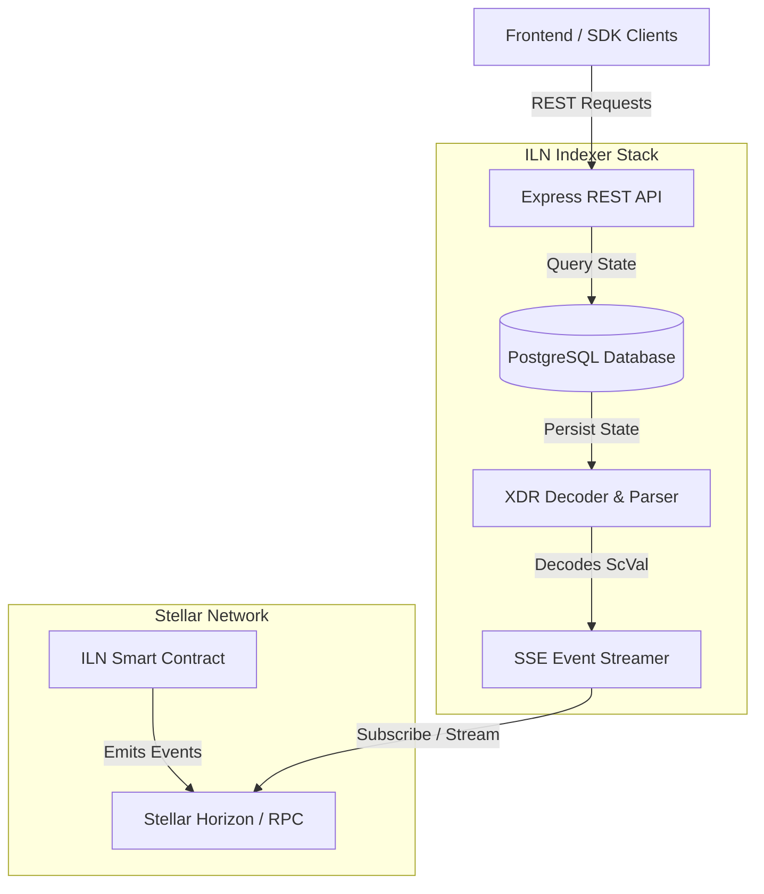

# ILN Event Indexer

The Invoice Liquidity Network (ILN) Event Indexer is a lightweight, high-performance service that tracks on-chain Soroban events emitted by the ILN smart contracts. It parses these events, stores state transitions in a relational database, and exposes a clean REST API for frontends, SDKs, and analytics dashboards.

---

## Table of Contents
1. [Architecture Overview](#architecture-overview)
2. [Environment Variables](#environment-variables)
3. [Docker Deployment](#docker-deployment)
4. [REST API Reference](#rest-api-reference)
5. [Troubleshooting](#troubleshooting)

---

## Architecture Overview

The indexer operates as an off-chain daemon utilizing Stellar Horizon's Server-Sent Events (SSE) streaming model to maintain a real-time replica of the protocol state. 

### Data Flow Diagram



### Components

1. **Event Streamer**: Maintains a persistent connection to the Horizon `/effects` or `/contract-events` streaming endpoints.
2. **XDR Parser**: Decodes raw Base64 XDR `ScVal` structures from topics and data payloads into native JavaScript types (integers, strings, booleans, bigints) mapping to the schemas defined in [docs/events.md](file:///c:/Users/Blessing%20Chidinma/ILN-Smart-Contract/docs/events.md).
3. **Database (PostgreSQL)**: Serves as the query-optimized relational storage layer for invoices, status histories, users, reputation records, and cursor tracking.
4. **REST API**: A RESTful HTTP service providing low-latency queries, statistics, and filtering.

---

## Environment Variables

Configure the indexer via environment variables. Create a `.env` file at the indexer directory root or inject them directly into your container.

| Variable | Description | Default | Example |
|----------|-------------|---------|---------|
| `DATABASE_URL` | PostgreSQL connection string containing credentials, host, port, and database name. | *Required* | `postgresql://postgres:password@db:5432/iln_indexer?sslmode=disable` |
| `HORIZON_URL` | URL of the Stellar Horizon server instance to stream events from. | `https://horizon-testnet.stellar.org` | `http://localhost:8000` (for local development) |
| `CONTRACT_ID` | The deployed address of the `invoice_liquidity` contract instance to monitor. | *Required* | `CD3TE3IAHM737P236XZL2OYU275ZKD6MN7YH7PYYAXYIGEH55OPEWYJC` |
| `PORT` | The port on which the Express REST API server will listen. | `3000` | `8080` |
| `START_LEDGER` | The ledger sequence to begin event crawling from if no previous cursor is saved in the DB. | `1` | `1024350` |
| `NODE_ENV` | Running environment mode. | `development` | `production` |

---

## Docker Deployment

Deploying the indexer alongside its PostgreSQL database is streamlined using Docker Compose.

### Dockerfile (Indexer Service)

Create the following `Dockerfile` inside the `indexer` folder:

```dockerfile
# indexer/Dockerfile
FROM node:20-alpine AS builder
WORKDIR /app
COPY package*.json tsconfig.json ./
RUN npm ci
COPY src/ ./src
RUN npm run build

FROM node:20-alpine
WORKDIR /app
COPY package*.json ./
RUN npm ci --only=production
COPY --from=builder /app/dist ./dist
EXPOSE 3000
CMD ["node", "dist/index.js"]
```

### Docker Compose Configuration

Use a `docker-compose.yml` to orchestrate the multi-container stack:

```yaml
version: '3.8'

services:
  db:
    image: postgres:15-alpine
    container_name: iln-indexer-db
    restart: unless-stopped
    ports:
      - "5432:5432"
    environment:
      POSTGRES_USER: postgres
      POSTGRES_PASSWORD: password
      POSTGRES_DB: iln_indexer
    volumes:
      - pgdata:/var/lib/postgresql/data
    healthcheck:
      test: ["CMD-SHELL", "pg_isready -U postgres"]
      interval: 5s
      timeout: 5s
      retries: 5

  indexer:
    build:
      context: ./indexer
      dockerfile: Dockerfile
    container_name: iln-indexer-api
    restart: unless-stopped
    ports:
      - "3000:3000"
    depends_on:
      db:
        condition: service_healthy
    environment:
      - DATABASE_URL=postgresql://postgres:password@db:5432/iln_indexer?sslmode=disable
      - HORIZON_URL=https://horizon-testnet.stellar.org
      - CONTRACT_ID=CD3TE3IAHM737P236XZL2OYU275ZKD6MN7YH7PYYAXYIGEH55OPEWYJC
      - PORT=3000
      - START_LEDGER=1

volumes:
  pgdata:
```

### Command Reference

* **Start the stack in detached mode:**
  ```bash
  docker compose up -d
  ```

* **Inspect real-time logs:**
  ```bash
  docker compose logs -f indexer
  ```

* **Stop and tear down the containers (preserving data):**
  ```bash
  docker compose down
  ```

* **Wipe all volumes (resetting database state):**
  ```bash
  docker compose down -v
  ```

---

## REST API Reference

The indexer serves JSON payloads over HTTP. All currency amounts are represented in **stroops** (Stellar's base unit, e.g., `1 USDC = 10,000,000 stroops`).

### 1. List Invoices
`GET /invoices`

Returns a list of all indexed invoices, supporting pagination and state filters.

#### Query Parameters
- `freelancer` (string, optional): Filter by freelancer public key.
- `payer` (string, optional): Filter by payer public key.
- `lp` (string, optional): Filter by LP (funder) public key.
- `status` (string, optional): Filter by status (`Pending`, `Funded`, `Paid`, `Defaulted`).
- `limit` (number, optional): Max records to return. Default `20`.
- `cursor` (number, optional): Offset or invoice ID for pagination.

#### Example Request
```http
GET /invoices?status=Funded&limit=1
```

#### Example Response
```json
[
  {
    "id": 42,
    "freelancer": "GBRPYHIL2C2O...",
    "payer": "GCFXQW472...",
    "funder": "GBLPXY275...",
    "token": "CBIELTK6YBZJU5UP2WWQEUCYKLPU6AUNZ2BQ4WWFEIE3USCIHMXQDAMA",
    "amount": "1000000000",
    "dueDate": 1735603200,
    "discountRate": 500,
    "status": "Funded",
    "fundedAt": 1700050000,
    "submittedAt": 1700000000,
    "updatedAt": 1700050000
  }
]
```

---

### 2. Fetch Single Invoice
`GET /invoices/:id`

Retrieves deep trace data for a specific invoice ID.

#### Example Request
```http
GET /invoices/42
```

#### Example Response
```json
{
  "id": 42,
  "freelancer": "GBRPYHIL2C2O...",
  "payer": "GCFXQW472...",
  "funder": "GBLPXY275...",
  "token": "CBIELTK6YBZJU5UP2WWQEUCYKLPU6AUNZ2BQ4WWFEIE3USCIHMXQDAMA",
  "amount": "1000000000",
  "dueDate": 1735603200,
  "discountRate": 500,
  "status": "Paid",
  "fundedAt": 1700050000,
  "submittedAt": 1700000000,
  "updatedAt": 1700100000,
  "history": [
    { "status": "Pending", "txHash": "a1b2...", "timestamp": 1700000000 },
    { "status": "Funded", "txHash": "c3d4...", "timestamp": 1700050000 },
    { "status": "Paid", "txHash": "e5f6...", "timestamp": 1700100000 }
  ]
}
```

---

### 3. Protocol Statistics
`GET /stats`

Aggregates global network statistics.

#### Example Request
```http
GET /stats
```

#### Example Response
```json
{
  "totalVolumeFundedStroops": "450000000000",
  "totalInvoicesSubmitted": 1250,
  "totalInvoicesPaid": 940,
  "totalInvoicesDefaulted": 12,
  "defaultRatePercent": 1.26,
  "activeLpsCount": 47
}
```

---

### 4. Participant Reputation
`GET /reputation/:address`

Retrieves the current reputation score and history for any address.

#### Example Request
```http
GET /reputation/GBLPXY275...
```

#### Example Response
```json
{
  "address": "GBLPXY275...",
  "score": 880,
  "tier": "Gold",
  "history": [
    { "change": 15, "reason": "Invoice Paid #31", "timestamp": 1700100000 },
    { "change": -50, "reason": "Default Claim #12", "timestamp": 1698000000 }
  ]
}
```

---

## Troubleshooting

### Stream Disconnections

Server-Sent Events (SSE) connections are susceptible to network drops, server restarts, or timeouts.

* **Symptom**: Indexer logs show `Stream disconnected. Retrying...` repeatedly, or the indexer falls behind the live ledger state.
* **Mitigation**:
  1. The indexer utilizes **exponential back-off reconnection** logic (reconnecting after 500ms, doubling up to a maximum of 30 seconds).
  2. The system tracks the latest successfully processed ledger event sequence ID (the `paging_token` or `cursor`) inside the `cursor_store` table in the database.
  3. Upon a reconnect, the streamer requests events starting from `?cursor={last_processed_paging_token}`. This prevents gaps and ensures **exactly-once processing** guarantees.
  4. Ensure your Horizon nodes are configured with appropriate TCP keep-alive settings to prevent load balancers from pruning idle event connections.

### Database Migration Failures

Database migration issues typically occur during deployments involving schema changes or when multiple instances of the service attempt to boot concurrently.

* **Symptom**: Container crashes with errors such as `relation "invoices" already exists` or `table "knex_migrations_lock" is locked`.
* **Mitigation**:
  1. **Locking Issues**: If a migration crashed midway, the lock table might remain active. Manually clear the migration lock in PostgreSQL:
     ```sql
     UPDATE knex_migrations_lock SET is_locked = 0;
     -- or equivalent for your migration library (e.g. Prisma, TypeORM)
     ```
  2. **Schema Drift**: If the schema is corrupted during local test cycles, perform a database migration rollback and re-apply:
     ```bash
     docker compose exec indexer npm run migrate:rollback
     docker compose exec indexer npm run migrate:latest
     ```
  3. **Wipe and Resync**: If schemas are incompatible and cannot be rolled back, clear the PostgreSQL volumes and let the indexer re-crawl events from the ledger height specified in `START_LEDGER`:
     ```bash
     docker compose down -v
     docker compose up -d
     ```
