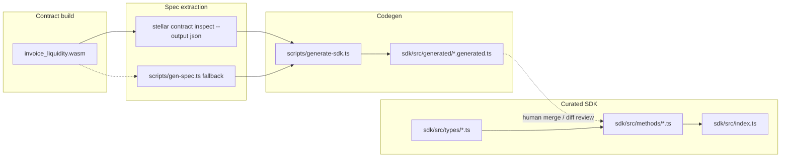

# SDK Code Generation Design (Issue #382)

Research spike: can Soroban contract ABI output drive automatic TypeScript SDK
stub generation for ILN?

**Status:** Prototype complete — hybrid approach recommended.

---

## 1. Executive summary

| Question | Answer |
|----------|--------|
| Can `stellar contract inspect` produce a machine-readable ABI? | **Yes** — JSON array of function/event/error spec entries embedded in WASM or fetched from a deployed contract ID. |
| Can that ABI drive TypeScript codegen? | **Partially** — scalar args, call wiring, and read vs write branching are automatable; validation, rich return types, auth semantics, and UX require hand-written layers. |
| Recommendation | Adopt a **hybrid pipeline**: `make spec` → `scripts/generate-sdk.ts` for skeleton stubs; keep curated methods in `sdk/src/methods/` as the public API. |

Prototype artifacts:

- Generator: [`scripts/generate-sdk.ts`](../scripts/generate-sdk.ts)
- Sample inspect JSON: [`docs/fixtures/stellar-inspect-invoice_liquidity.sample.json`](fixtures/stellar-inspect-invoice_liquidity.sample.json)
- Generated stubs (3 methods): [`sdk/src/generated/`](../sdk/src/generated/)
- Fallback spec (source-derived): [`docs/contract-spec.json`](contract-spec.json)

---

## 2. `stellar contract inspect` output format

### 2.1 How to capture the spec

Three equivalent sources (Makefile prefers WASM when the toolchain is present):

```bash
# From built WASM (canonical — reads embedded soroban-spec)
stellar contract inspect \
  --wasm target/wasm32v1-none/release/invoice_liquidity.wasm \
  --output json > docs/stellar-inspect-invoice_liquidity.json

# From a deployed testnet contract (no local Rust build required)
stellar contract inspect \
  --id CD3TE3IAHM737P236XZL2OYU275ZKD6MN7YH7PYYAXYIGEH55OPEWYJC \
  --network testnet \
  --output json > docs/stellar-inspect-invoice_liquidity.json

# Human-readable table (useful for docs, not for codegen)
stellar contract inspect --id CD3TE3IAHM737P236XZL2OYU275ZKD6MN7YH7PYYAXYIGEH55OPEWYJC --network testnet
```

Testnet contract IDs (from [README](../README.md#testnet-deployment)):

| Contract | ID |
|----------|-----|
| `invoice_liquidity` | `CD3TE3IAHM737P236XZL2OYU275ZKD6MN7YH7PYYAXYIGEH55OPEWYJC` |
| `iln_governance` | `C2AAAAAAAAAAAAAAAAAAAAAAAAAAAAAAAAAAAAAAAAAAAAAAAAAAAAAAA` |
| `iln_distribution` | `C2AAAAAAAAAAAAAAAAAAAAAAAAAAAAAAAAAAAAAAAAAAAAAAAAAAAAAAB` |
| `reputation_bonus` | `C2AAAAAAAAAAAAAAAAAAAAAAAAAAAAAAAAAAAAAAAAAAAAAAAAAAAAAAC` |

The inspect command reads the **embedded Soroban spec** (`soroban-spec` crate) that rustc attaches to every `#[contractimpl]` export at build time.

### 2.2 JSON shape

`--output json` emits a **top-level JSON array**. Each element describes one spec entry (function, struct, enum, error, event). Function entries look like:

```json
{
  "doc": "Returns the invoice with the given invoice_id. Access: Anyone",
  "name": "get_invoice",
  "inputs": [
    { "doc": "", "name": "invoice_id", "type": "u64" }
  ],
  "outputs": [
    { "type": { "result": { "ok": "Invoice", "error": "ContractError" } } }
  ]
}
```

Observed properties:

| Field | Type | Notes |
|-------|------|-------|
| `name` | `string` | Snake-case Rust export name (`submit_invoice`). |
| `doc` | `string` | Rust `///` doc comment — useful for JSDoc. |
| `inputs` | `{ name, type, doc? }[]` | Excludes the implicit `Env` parameter. |
| `outputs` | `{ type }[]` | Usually one element; `Result<T, E>` encoded as nested objects. |
| `type` (inputs/outputs) | `string` or nested object | Scalars are strings (`u64`, `Address`); composites use `{ option: T }`, `{ vec: T }`, `{ result: { ok, error } }`. |

Non-function entries (struct definitions for `Invoice`, error enums, event shapes) appear as separate array elements with different keys depending on CLI version. The generator prototype filters entries that expose a `name` + `inputs` pair.

### 2.3 Comparison with existing `docs/contract-spec.json`

[`scripts/gen-spec.ts`](../scripts/gen-spec.ts) (Issue #111) produces a **flattened, repo-friendly** JSON when WASM/CLI is unavailable:

```json
{
  "contract": "InvoiceLiquidityContract",
  "functions": [
    {
      "name": "get_invoice",
      "doc": "...",
      "parameters": [{ "name": "invoice_id", "type": "u64" }],
      "returns": "Result<Invoice, ContractError>"
    }
  ],
  "errors": [...],
  "events": [...]
}
```

Both formats normalize to the same internal model in `generate-sdk.ts` (`normalizeStellarInspect` vs `normalizeGenSpec`).

---

## 3. Comparison with other ecosystems

### 3.1 CosmWasm (`cosmwasm-schema` + `@cosmjs`)

| Aspect | CosmWasm | Soroban / ILN |
|--------|----------|---------------|
| ABI source | `schema/` JSON from `cosmwasm-schema` derive | Embedded spec in WASM; `stellar contract inspect` |
| Codegen maturity | `@cosmjs/cosmwasm-stargate` + community `cosmwasm-ts-codegen` | No official TS codegen; stellar-sdk `Contract.call` is manual |
| Type fidelity | Strong — JSON Schema drives TS interfaces | Structs referenced by name; inspect JSON does not inline full TS types |
| Client pattern | `SigningCosmWasmClient.execute(msg)` | `Contract.call` + simulate/send + `nativeToScVal` |

**Takeaway:** CosmWasm codegen works because schema files are first-class and JSON-Schema-native. Soroban spec is equally structured but lacks a maintained TS emitter in the Stellar org — a gap ILN can fill internally.

### 3.2 Ethers.js (Solidity ABI)

| Aspect | Ethers.js | Soroban / ILN |
|--------|-----------|---------------|
| ABI format | JSON array of `{ type, name, inputs, outputs, stateMutability }` | JSON array of spec entries with nested type objects |
| Codegen | `Contract` factory + typed interfaces via TypeChain | Prototype `generate-sdk.ts` |
| Read vs write | `view` / `pure` vs transactional | Inferred from return type + naming (`get_*` → simulate) |
| Value encoding | ABI encoder handles packing | Developer maps to `nativeToScVal` per arg type |

**Takeaway:** Ethers proves ABI-driven stubs eliminate boilerplate. Soroban needs an explicit ScVal mapping layer (see §4.2).

---

## 4. Prototype generator

### 4.1 Usage

```bash
# Default: three stubs from docs/contract-spec.json
npx tsx scripts/generate-sdk.ts

# From inspect fixture or live CLI
npx tsx scripts/generate-sdk.ts --inspect-json docs/fixtures/stellar-inspect-invoice_liquidity.sample.json
npx tsx scripts/generate-sdk.ts \
  --contract-id CD3TE3IAHM737P236XZL2OYU275ZKD6MN7YH7PYYAXYIGEH55OPEWYJC \
  --network testnet \
  --only submit_invoice,get_invoice,mark_paid

# Tests (no network)
npx tsx --test scripts/generate-sdk.test.ts
```

### 4.2 What the generator produces

For each selected function it emits:

1. Typed parameter list (`u64` → `bigint`, `Address` → `string`, …).
2. `contract.call("snake_name", …nativeToScVal args…)`.
3. **Read-only path:** `simulateTransaction` + `scValToNative`.
4. **Write path:** `prepareTransaction` → sign → `sendTransaction` → `{ txHash }`.

Generated files land in `sdk/src/generated/*.generated.ts` and are **not** exported from the public SDK entrypoint — they serve as drift-detection artifacts and starting points for hand-written methods.

### 4.3 Prototype limitations (by design)

| Gap | Why manual work remains |
|-----|-------------------------|
| Complex return types (`Invoice` struct) | Spec references struct name; TS interface must come from `sdk/src/types/` or a future struct emitter. |
| Pre-flight validation | Hand-written methods enforce business rules (due dates, discount bps, auth). |
| Error mapping | `ILNError` subclasses map contract error codes — not in inspect output semantics. |
| `Option<T>` / `Vec<T>` ScVal encoding | Generator emits `/* TODO */` for non-scalar encodings. |
| Method naming / ergonomics | Generator uses camelCase of Rust name; public SDK uses domain names (`submitInvoice` params object). |
| Events / subscriptions | Separate spec entries; not covered by this spike. |

---

## 5. Feasibility assessment

| Capability | Feasible? | Confidence |
|------------|-----------|------------|
| Detect new/changed contract functions vs SDK | **Yes** | High — diff normalized spec against exported methods |
| Generate call skeletons for all 60 exports | **Yes** | High — prototype proves pipeline |
| Replace hand-written SDK entirely | **No** | High — validation, types, and UX need curation |
| CI gate: spec drift fails build | **Yes** | Medium — extend `make spec` + diff step |
| Generate struct TS types from spec | **Partial** | Medium — requires struct-entry parser (next iteration) |

---

## 6. Recommended architecture



### Proposed CI integration (future issue)

1. `make spec` — refresh `docs/contract-spec.json` from WASM in CI after `cargo build`.
2. `npx tsx scripts/generate-sdk.ts --only $(all)` — regenerate full stub tree.
3. Fail if `git diff sdk/src/generated` is non-empty without a matching SDK version bump.
4. Optional: warn when spec contains function names absent from `sdk/src/methods/`.

### Suggested Makefile target (future)

```makefile
sdk-stubs: spec ## Regenerate SDK method stubs from contract spec
	npx tsx scripts/generate-sdk.ts --spec docs/contract-spec.json --only $(SDK_GEN_FUNCTIONS)
```

---

## 7. Prototype deliverables checklist

- [x] Document `stellar contract inspect` output format (§2)
- [x] Compare with CosmWasm and Ethers.js approaches (§3)
- [x] Prototype [`scripts/generate-sdk.ts`](../scripts/generate-sdk.ts)
- [x] Generate ≥3 typed method stubs (`getInvoice`, `cancelInvoice`, `markPaid`)
- [x] Unit tests for normalizer and generator ([`scripts/generate-sdk.test.ts`](../scripts/generate-sdk.test.ts))
- [x] Record recommendation: hybrid codegen + curated SDK (§6)

---

## 8. Next steps (out of scope for #382)

1. **Struct emitter** — parse struct spec entries → `sdk/src/types/generated.ts`.
2. **Drift CI job** — fail PRs when contract spec changes without regenerated stubs.
3. **Error enum sync** — map `ContractError` codes to `ILNError` from spec.
4. **Event typings** — generate `subscribe()` event union from event spec entries.
